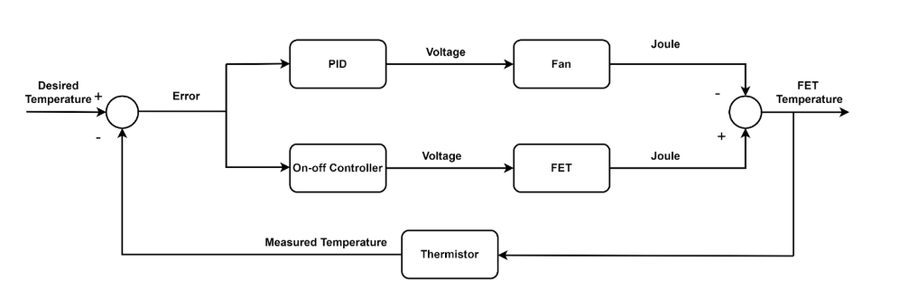
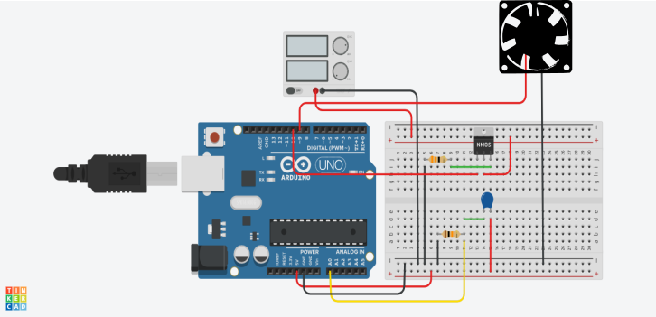

This repo is for the term project of E407 Process Control Laboratory.

## **Overview**  
This project establishes an experiment to observe the functionality of a digital controller in a closed-loop system and to regulate the temperature of the FET transistor within the designed circuit configuration at a specified operating point.

Block diagram of the system is shown below.

Here is the circuit shematic of the system.

  

## **Video Demonstration**  
Watch the project in action here:  
- [Project Video](https://youtu.be/wL4fu9uugyQ)  

## Final Report
- [Project Final Report (PDF)](https://github.com/berfinkokmen/Temperature-Control-in-a-Miniaturized-Heating-Process/blob/main/EE407-Process%20Control%20Term%20Project%20Report%20.pdf)
